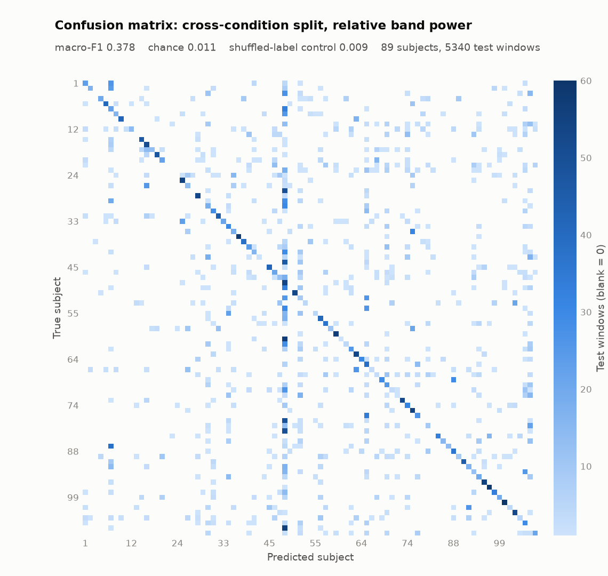
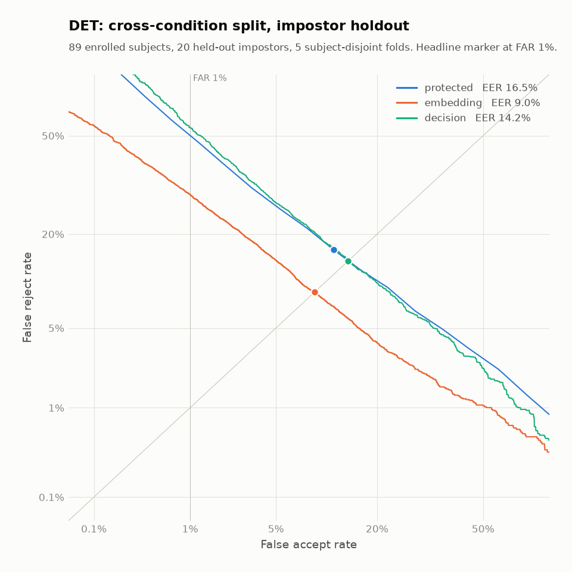
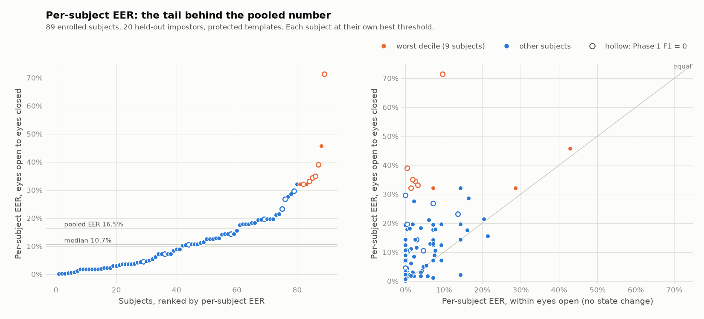

# NeuroAuth

Continuous biometric authentication from a live EEG stream. Verifies identity against
a claimed subject, revokes the session when the signal stops matching, learns from
reviewed false rejections, and retrains behind an evaluation gate.

**Status: Phase 2 verification results in** — open-set verification with protected
templates. Session evaluation and the database are next. See
[`docs/ROADMAP.md`](docs/ROADMAP.md) for the plan, [`docs/PROGRESS.md`](docs/PROGRESS.md)
for current state, and [`docs/DECISIONS.md`](docs/DECISIONS.md) for why things are the
way they are.

---

## Data and attribution

This project uses the **PhysioNet EEG Motor Movement/Imagery Database (eegmmidb)
v1.0.0** — 109 subjects, 64 channels, 160 Hz, EDF+.

> Goldberger, A., Amaral, L., Glass, L., Hausdorff, J., Ivanov, P. C., Mark, R.,
> Mietus, J. E., Moody, G. B., Peng, C. K., & Stanley, H. E. (2000). PhysioBank,
> PhysioToolkit, and PhysioNet: Components of a new research resource for complex
> physiologic signals. *Circulation*, 101(23), e215–e220.
>
> Schalk, G., McFarland, D. J., Hinterberger, T., Birbaumer, N., & Wolpaw, J. R.
> (2004). BCI2000: A general-purpose brain-computer interface (BCI) system. *IEEE
> Transactions on Biomedical Engineering*, 51(6), 1034–1043.

Licensed under **Open Data Commons Attribution License (ODC-By) v1.0**. Attribution
is required and is reproduced here and in the application footer.

### Stated limitation

eegmmidb is **single-session**. Cross-session drift cannot be demonstrated with this
dataset, and this project never claims otherwise. Monitoring detects *within-session
temporal drift* across runs. The same limitation bounds what the results below can say
about confounds, and about which failures belong to a person rather than to one recording.

---

## Phase 1 results: identification baseline

Closed-set identification over the 89 enrollable subjects. This is a scaffold that
validates the signal pipeline; Phase 2 replaces it with open-set verification reported
as EER, FAR, and FRR. Twenty impostor subjects were chosen and committed before any
result existed ([`config/impostor_holdout.json`](config/impostor_holdout.json)) and are
untouched here.

**Setup.** Resting-state runs only (R01 eyes open, R02 eyes closed). 2 s windows with
50% overlap, Welch band power in five bands across 64 channels, Random Forest. Chance
macro-F1 is 1/89 = **0.011**. Every model also gets a shuffled-label control, and every
threshold used to judge a result was fixed before the run it judges
([D-016](docs/DECISIONS.md)).

| Band power | Split | Macro-F1 | Shuffled-label control |
|---|---|---|---|
| **relative** | **eyes open → eyes closed (headline)** | **0.378** | 0.009 |
| relative | within recording, time-blocked | 0.846 | 0.010 |
| absolute (log) | eyes open → eyes closed | 0.597 | 0.005 |
| absolute (log) | within recording, time-blocked | 0.956 | 0.015 |



### 1. A change of brain state is the dominant effect

Training on eyes-open and testing on eyes-closed is the closest this dataset gets to
the deployment question: a user enrolls alert and authenticates tired. Macro-F1 falls
from 0.846 within a recording to 0.378 across the state change. Per subject, the median
F1 is 0.36 and **14 of 89 subjects score zero** — identity features survive the change
for most people and not at all for some.

### 2. A random split would score higher, and the difference is leakage

Windows overlap by 50%, so a random split puts windows that share samples on both sides
of the train/test boundary. Run deliberately as a labelled demonstration on the
within-recording data, it scores **0.906 against 0.846** for the guarded time-blocked
split. 90% of its test windows share samples with a training window.

The shuffled-label control on that leaky split reads **0.011 — chance**. The standard
leakage control cannot see this leak: each memorized window carries a scrambled label.
Overlap is ruled out structurally instead, by an assertion that runs on every split
([D-002, D-007, D-017](docs/DECISIONS.md)).

### 3. Absolute power scores higher, and that gap is an upper bound

Absolute band power beats relative by **0.219** across the state change and **0.110**
within a recording. With one session per subject, the amplitude information behind that
gap **cannot be separated from session artifacts** — electrode impedance, cap placement,
amplifier gain — **so the gap is an upper bound on their contribution**. Part of it may
be anatomy, such as skull thickness, which is person-specific and would survive a second
session. Relative power is the headline because it discards per-channel amplitude
scaling, whatever its source ([D-004](docs/DECISIONS.md)).

### 4. Eye movement: a small effect, not acted on

Electrodes above the eyes pick up blinks, which are person-specific within a sitting.
Models trained on eyes-open data put **1.23× (relative) and 1.35× (absolute)** the
share of importance on Fp1/Fp2/AF7/AF8 that even spreading would give them. Models
trained on both conditions put **1.05× and 0.88×** there. The contrast runs the way the
hypothesis predicts, but the effect is too small to act on ([D-004b](docs/DECISIONS.md)).

### 5. Muscle activity: a material dependence, bounded rather than decomposed

In every model the most important channels sat over the temporal muscles (T9, T10, T7,
T8) and gamma (30–50 Hz) was the top band — where scalp muscle activity (EMG) shows up.
Two ablations of the headline test how much it depends on those features, judged
against a 0.05 macro-F1 materiality threshold fixed before either ran
([D-018](docs/DECISIONS.md)):

| Headline model | Macro-F1 | Drop | Shuffled-label control |
|---|---|---|---|
| all features | 0.378 | — | 0.009 |
| without the gamma band (relative power renormalized over 1–30 Hz) | 0.263 | **0.116** | 0.009 |
| without the 8 lateral temporal sites | 0.300 | **0.078** | 0.007 |

Both drops are material. **Neither is a measure of EMG.** Gamma at temporal sites
contains both muscle and neural activity, and scalp EEG cannot separate them. So each
drop is an upper bound on what information unique to the removed features — muscle and
neural together — contributes to the headline.

The bounds are also narrower than they look. With gamma removed, beta becomes the top
band and the temporal sites still lead the channel ranking. With the temporal sites
removed, gamma stays the top band, and Iz and frontal channels move to the top of the
channel ranking. Each ablation leaves the other route open, so neither bounds the
model's dependence on temporal-site or high-frequency features as a whole.

### Reproducibility

- Artifacts come from a clean, pushed commit. `scripts/train_baseline.py` refuses to
  write `artifacts/` from uncommitted code, and refuses to run unless the impostor
  holdout file is committed and unmodified.
- Seeds are fixed. Re-running from a later commit reproduced all four baseline models'
  artifacts byte for byte.
- Every artifact records its config fingerprint, split parameters, thresholds, and
  package versions (`artifacts/run_summary.json`). None contains a feature vector.

---

## Phase 2 results: open-set verification

The question is now whether a 2 s window is the claimed subject or someone else. Each window
is scored against that subject's protected template, and impostors include 20 subjects who
were never trained on or enrolled.

**Setup.**

- **Subjects.** The 89 enrollable subjects are split into five subject-disjoint folds. Each
  fold's embedding is fitted on the other four, so every genuine user is also unseen by the
  model that verifies them. The 20 held-out impostors, committed before any result, appear
  only as impostor probes.
- **Enrollment and probes.** Enrollment uses eyes-open (R01). Every probe, genuine or
  impostor, is eyes-closed (R02).
- **Pipeline.** Relative band power from bounded-context filtering, identical offline and
  live ([D-020](docs/DECISIONS.md)), a shrinkage-LDA embedding, and 64-bit keyed BioHash
  templates ([D-023](docs/DECISIONS.md)).
- **Scope of the numbers.** Scores are per 2 s window. A session integrates many windows,
  and sessions have not been evaluated yet.
- **Thresholds.** Every threshold that judges a result was fixed before the run
  ([D-022](docs/DECISIONS.md)). One reporting change was made afterwards; it is disclosed
  below ([D-024](docs/DECISIONS.md)).

| Split | EER [95% CI] | FAR / FRR at the EER threshold | FRR at FAR 1% | FRR at FAR 0.1% |
|---|---|---|---|---|
| **eyes open → eyes closed (headline)** | **16.5%** [12.3–18.4] | 11.8% / 16.5% | 55.2% | 76.9% *(under-resolved)* |
| within eyes open, time-blocked | 5.9% [4.6–8.2] | 5.9% / 5.4% | 19.5% | 43.3% *(under-resolved)* |

The headline row pools 4,984 genuine and 99,591 impostor window comparisons over 1,780
claimed–impostor subject pairs. The intervals come from a bootstrap that resamples subjects,
never individual windows. FAR 0.1% would need at least 3,000 pairs to resolve, and no split
of 109 subjects provides that many, so it is reported and flagged rather than interpreted.

**The headline was changed after the results were seen.** The registered headline was FRR at
FAR 1% (D-022). It was changed to EER once the run showed FRR 55.2% at that operating point.
The stated reason is that FAR 1% sits far past the EER crossover (threshold 0.6875 against
0.594), where FRR climbs quickly. That reason was given after the number was known, so both
numbers stay in the table and the change is recorded as post hoc (D-024). Two facts belong
next to the EER:

- at the EER threshold, about one impostor window in 8.5 is accepted;
- at FAR 1%, more than half of genuine windows are rejected.

Both are window-level rates. What a user experiences depends on how a session integrates
windows, which is not yet evaluated.



### 1. The per-subject tail is a primary result

A pooled EER of 16.5% averages over a very uneven population. Here is each subject's EER,
computed at that subject's own best threshold:

| | best | p10 | p25 | median | p75 | p90 | worst |
|---|---|---|---|---|---|---|---|
| per-subject EER | 0.09% (S090) | 1.8% | 3.6% | **10.7%** | 19.3% | **32.1%** | 71.4% (S108) |

The best decile averages 0.7%. The worst decile (9 subjects) averages **39.5%**, not far
from the 50% of guessing. Each subject is already at their own optimal threshold, so this is
a separability failure, not a calibration one: no threshold rescues these subjects. The
pooled number hides that, across this brain-state change, verification is close to unusable
for about one user in ten.

This was predicted before the run (P1a: worst-decile mean at least 2× the median and at least
10 points above it) and is **confirmed**.



### 2. The same people fail identification and verification

- **Registered (P1b).** Spearman ρ = **−0.63** between Phase 1 per-subject F1 and Phase 2
  per-subject EER, permutation p < 0.001. **Confirmed.** Of the 14 subjects with Phase 1
  F1 = 0, 10 fall in the worst quartile of EER, where 3.5 would be expected by chance.
- **Post hoc.** **6 of the 9** worst-decile subjects scored F1 = 0 in Phase 1 (1.4 expected;
  hypergeometric p = 3×10⁻⁴), and 8 of the 9 scored below 0.1.

A closed-set Random Forest and an open-set LDA embedding with protected templates fail on the
same people. The failure is not an artifact of one classifier or of the closed-set framing.

**What that agreement cannot show, and what the within-state split does.** Both phases use
the same recordings, the same features, and the same eyes-open → eyes-closed structure. Their
agreement therefore cannot tell "this person is hard to verify" apart from "this person's EEG
changes a lot when they close their eyes." The time-blocked split, which stays within
eyes-open, can:

- **7 of the 9** worst-decile subjects verify within eyes-open at a per-subject EER below 10%.
- Only S043 and S068 are in the worst decile of both splits (0.9 expected; p = 0.22).
- The per-subject rank correlation between the splits is ρ = 0.48.

So the tail is mostly a property of a subject together with the state change, not of the
subject alone. Most of these people are verifiable, just not across a change their enrollment
did not cover. That reading is post hoc, and the within-state per-subject EER is coarse
(13–14 genuine windows each). With one session per subject, none of this separates a person
from their recording.

### 3. The brain-state change dominates again

EER is 5.9% within eyes-open and 16.5% across the change: **2.8× worse**, with
non-overlapping intervals. Phase 1 went the same way (macro-F1 0.846 within, 0.378 across).
This is the same effect under a second model and task framing, not an independent
replication, because the recordings, features, and split structure are shared. The two ratios
are on different metrics (an error rate against an F1) and should not be compared as numbers.

### 4. What template protection costs

| Scores | EER, eyes open → closed | EER, within eyes open |
|---|---|---|
| Unprotected embedding (in memory only, never stored) | 9.0% | 3.0% |
| **Protected 64-bit templates (headline)** | **16.5%** | **5.9%** |
| Decision layer v0 on protected scores ([D-021](docs/DECISIONS.md)) | 14.2% | 5.4% |

Protection costs 7.4 EER points across the state change and 2.9 within it. Both exceed the
0.02 materiality threshold fixed before the run. Part of that cost is quantization: similarity
moves in steps of 1/64, so no threshold makes FAR and FRR equal (11.8% against 16.5% at the
EER threshold). The decision layer recovers 2.3 points by using each template's enrollment
statistics. It is reported next to the headline, not instead of it.

### 5. Revocation works

Every template was reissued under a new key from the same enrollment windows. Revoked and
reissued templates agree on 49.2% of bits (49.5% within eyes-open), where chance is 50%. None
of the 89 revoked templates is accepted by its reissued template at the deployed threshold.
The criteria were fixed before the run: agreement between 45% and 55%, and at most 3%
accepted.

### Controls and limits

- **Random-pairing control.** Each subject's genuine scores are replaced by scores against a
  different enrolled subject. Across all six split and score tables, EER lands between 45.7%
  and 54.9%; at least 40% was required.
- **Enrollment and quality.** No failures to enroll. 58 probe windows were flagged by the
  quality mask; they were scored, not excluded.
- **Deployed threshold.** Chosen on cohort impostors only. Its realized FAR on the held-out
  impostors is 0.67% against a 1% target.
- **Limits.**
  - Single-session data: nothing here measures robustness across days.
  - The evaluation's master secret is public, so these numbers measure the protocol, not key
    secrecy.
  - The served demo model is fitted on all 89 subjects; only the fold models produced these
    numbers.

A proposal for per-subject thresholds is under review; it has not been implemented
([docs/PHASE2_PER_SUBJECT_THRESHOLDS.md](docs/PHASE2_PER_SUBJECT_THRESHOLDS.md)).

---

## Getting started

```bash
python -m venv .venv && .venv/Scripts/activate    # Windows
pip install -e ".[dev]"

python -m scripts.verify_dataset --subjects 5      # fetch + validate
pytest                                             # add -m "not slow" without data
python -m scripts.train_baseline                   # Phase 1; needs a clean, committed tree
python -m scripts.evaluate_verification            # Phase 2; needs a clean, committed tree
python -m scripts.report_verification_tail         # per-subject tail, from committed artifacts
```

The impostor holdout is already fixed in `config/impostor_holdout.json`;
`scripts/select_holdout.py` refuses to overwrite it. The Postgres schema and Docker
Compose setup are written but not yet exercised.
